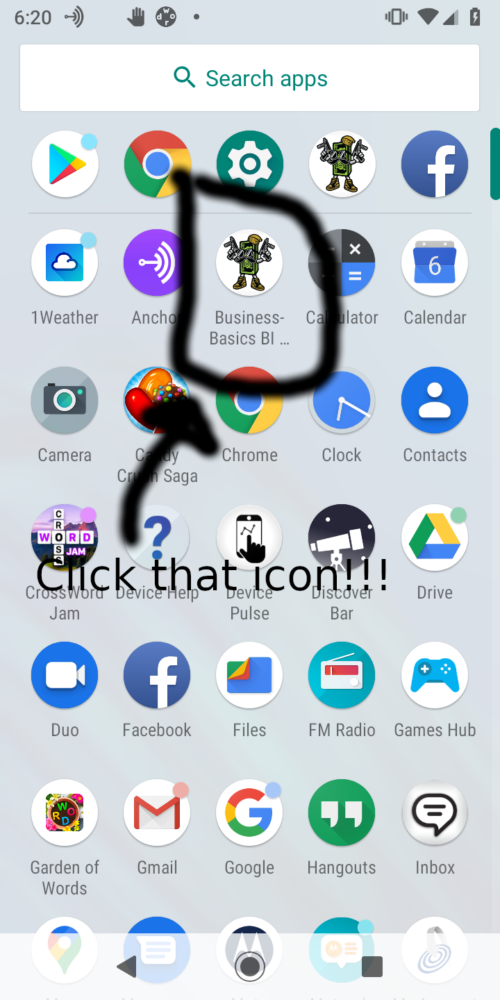

<pre>
This is an android app to teach people how to create tabs and fragments for there apps.
At the same time it should teach people about basic business , accounting and finance mathematics.
There is extra tabs that you can add stuff to and customize as you like.
</pre>

<b>Screen shots of what it looks like </b>
 
  
 
 
<b>Compound Interest Tab ScreenShot</b>
 
  
  
  
 <b>Mortgage Calculator ScreenShot</b>
  
  
 
 
<b>
 Import the BusinessBasicBI.zip into your android studio, Build , and Customize as you Like.
  
 Android is a cool opensource embedded operating system runs on many different ARM devices. Maybe someday you will be an electronic engineer programming firmware of a electronic device. Android , Raspberry PI and Audrino Studios all stuff you should familarize with if you think your going the electronic engineering route!
 
 Maybe your not to into the electronic engineering side of things thats fine to you find alot of use studying the computation math for mortgages and compound interest. Maybe some day you will be the next CPA certified accountant , Financial planner , Actuarialist or Economist. </b>
